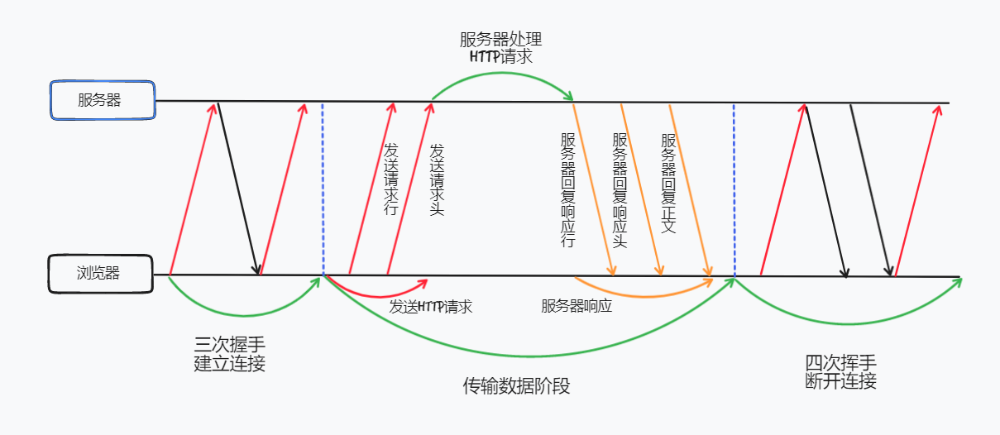
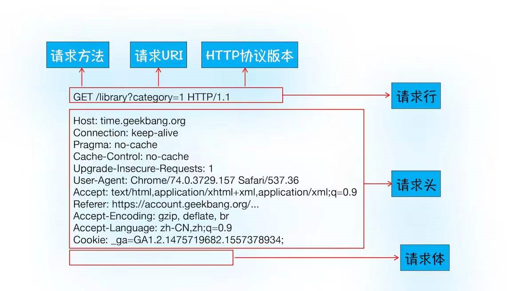
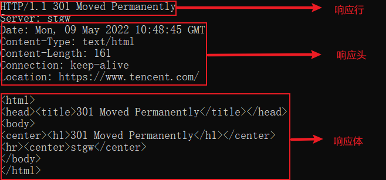
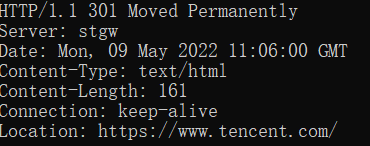
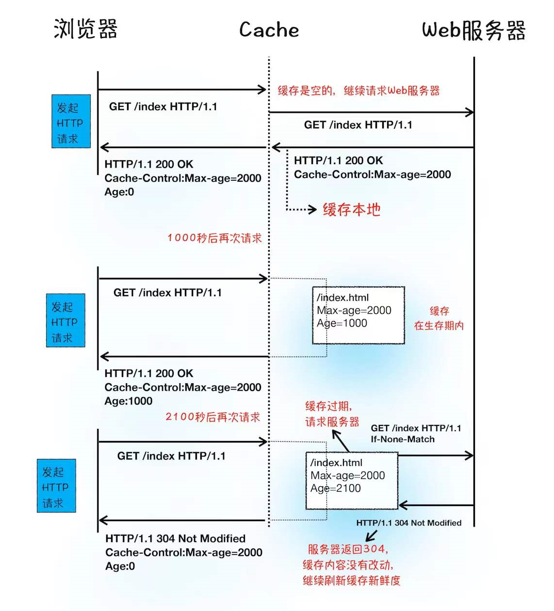
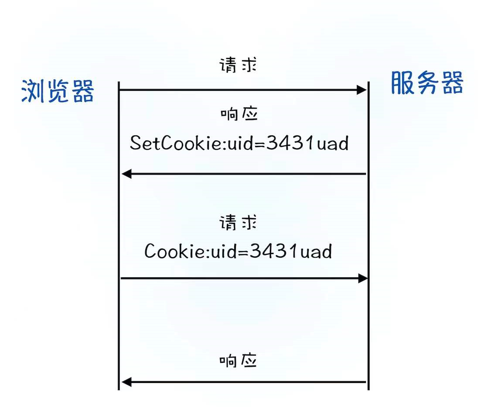

# HTTP请求流程

**HTTP是一种允许浏览器向服务器获取资源的协议，是Web基础**。通常由浏览器发起请求，用来获取不同类型的文件。例如：HTML文件、CSS文件、JavaScript文件、图片、视频等。此外，**HTTP也是浏览器使用最广的协议**，所以要想学好浏览器，就要深入了解HTTP。

#### 浏览器端发起HTTP请求流程

如果你在浏览器地址栏输入http://google.com。浏览器会完成哪些动作呢？

 ##### 1.构建请求

   首先浏览器构建**请求行**信息，构建好后，浏览器准备发起网络请求。

   ```
   GET /index.html HTTP1.1
   ```

 ##### 2.查找缓存

   在真正发起网络请求之前，浏览器会先在浏览器缓存中查询是否有要请求的文件。其中、**浏览器缓存是一种在本地保存资源副本，以供下次请求时直接使用的技术**

   当浏览器发现请求的资源已经在浏览器缓存中有副本，它会拦截请求，返回该资源的副本，并直接结束请求，而不会取源服务器重新下载。

   - 缓解服务器端压力，提升性能（获取资源耗时更短了）

   - 对于网站来说，缓存是实现快速资源加载的重要组成部分

   当然，如果查找缓存失败，就会进入网络请求过程中了。

 ##### 3.准备IP地址和端口

   因为浏览器使用**HTTP协议作为应用层协议**，用来封装请求的文本信息；并使用**TCP/IP作为传输层协议**将它发到网络上，所以在HTTP工作开始之前浏览器需要通过TCP与服务器建立连接。也就是说**HTTP的内容是通过TCP的传输数据阶段来实现的**

   

      从上图看：

   -  HTTP网络请求的第一步是**和服务器建立TCP连接**。
   - 建立TCP连接的前提就是准备好IP地址和端口号。
   -  那么怎么获取IP地址和端口号呢？这得看看我们现在有什么，我们有一个URL地址，那么是否可以利用URL地址来获取IP和端口信息呢？

   我们从前面的学习可以知道，**数据包**都是通过IP地址传输给接收方的。由于IP地址是数字    标识，难以记忆，但是使用域名（www.google.com）就好记忆多了，所以基于这个需求又出现    一个服务，负责把域名和IP地址做一一映射关系。这套域名映射为IP的系统就叫做**域名系统    **，简称**DNS (Domain Name System)**

   所以第一步应该是**请求DNF返回域名对应的IP**。当然浏览器还提供了**DNS数据缓存服务    **，如果某个域名已经解析过了，那么浏览器会缓存解析的结果，以供下次查询时直接使用，    这样也会减少一次网络请求。

   拿到IP后，接下来就要获取端口号了，通常情况下，如果URL没有特别指明端口号，那么HTTP    协议默认端口为80端口。

 ##### 4.等待TCP队列  

​      现在已经吧端口和IP地址都准备好了，那么下一步是不是可以建立TCP连接了呢？

​      还不行。

​      Chrome有个机制，同一个域名同时最多只能建立6个TCP连接，如果在同一个域名下同时 有10个请求正在发生，那么其中4个请求会进入排队等待状态。如果当前请求数量少于6，会直接进入下一步，建立TCP链接

 ##### 5.建立TCP连接

   排队等待结束之后，终于可以和服务器握手了，在HTTP工作开始之前，浏览器通过TCP与服务器建立连接。而TCP的工作方式，我们已经在前面介绍过了。

 #####    6.发送HTTP请求

    一旦建立了TCP链接，浏览器就可以和服务器进行通信了。而HTTP中的数据正是在这个通信过程中传输的

首先浏览器会向服务器发送**请求行**，它包括了**请求方法、请求URL（Uniform Resource Identifer）和HTTP协议**

发送请求行，就是告诉服务器浏览器需要什么资源，最常用的请求方法是GET。比如直接在浏览器输入域名，就是告诉服务器要请求它的首页资源。

另一个常用的请求方式就是POST，它用于发送一些数据给服务器，比如表单提交，浏览器还需要准备数据给服务器，这里的准备数据是通过请求体来发送。

在浏览器发送请求行命令之后，还要以**请求头**形式发送一些其他信息，把浏览器的一些基础信息告诉服务器。比如包含了浏览器所使用的操作系统、浏览器内核等信息，以及当前请求的域名信息、浏览器端的Cookie信息等等。

##### 7.  服务器端处理HTTP请求流程

   ###### 1.返回请求

   一旦服务器处理结束，便可以返回数据给浏览器了。你可以通过同居软件curl来查看返回请求数据，具体使用方法是在命令行中输入以下命令

   ```
   curl -i https://tencent.com
   ```

   这里加上-i是为了返回相应行、响应头和相应体的数据，返回的结果如下图所示。

   

​    首先服务器会返回**响应行**，包括协议版本和状态码 200 成功 404 没有找到资源 等等

​    随后，正如浏览器会随同请求发送请求头一样，服务器也会随同响应向浏览器发送**响应头**。响应头包含了服务器自身的一些信息，比如   服务器生成返回数据的时间、返回的数据类型(JSON、HTML、流媒体等类型)，以及服务器要在客户端保存的Cookie等信息。发送完响应头后，服务器就可以继续发送**响应体**的数据，通常就包含了HTML的实际内容。

###### 2.断开链接

通常情况下，一旦服务器向客户端返回了请求数据，他就要关闭TCP链接。不过如果浏览器或者服务器在其头信息中加入了

```
Connection: Keep-Alive
```

那么TCP链接在发送后仍然保持打开状态，这样浏览器就可以继续通过同一个TCP链接发送请求。**保持TCP链接可以省区下次请求时需要建立连接的时间，提升资源加载速度**

###### 3.重定向

我们在浏览器输入 https://tencent.com ，最终打开的页面是https://www.tencent.com/zh-cn/。

我们可以在控制台键入

```
curl -I https://tencent.com
```

注意这里输入的是`-I`，和`-i` 不一样，`-I`表示只需要获取响应头和响应行数据，而不需要获取响应体数据，最终返回的数据如下图所示。同样也是一个**重定向**，而需要重定向的网址正式包含在响应头的**Location**字段中



#### 1浏览器的缓存流程图



首先我们看下服务器是通过什么方式让浏览器缓存数据的？

从上图的第一次请求可以看出，当服务器返回**HTTP响应头**给浏览器时，浏览器是**通过响应头中的Cache-Control字段来设置是否缓存该资源**。通常我们需要为这个资源设置一个缓存过期时长，这个时长通过Cache-Control的Max-age字段来控制，上图就是设置缓存为2000秒。如果没过期则使用缓存中的资源给浏览器，如果缓存过期了，就会重新发起请求，并在HTTP头中带上

```
If-None-Match:"xxxx"
```

服务器收到请求头后，会根据`If-None-Match`的值来判断请求的资源是否有更新

- 如果没有更新，就返回304状态码，告诉浏览器这个资源没有过期，你还可以继续使用，这次就不重复发数据给你了。
- 如果资源有更新，服务器就会直接返回最新资源给浏览器。

#### 2.登录状态如何保持

- 用户打开登陆页面，在登录框里填入用户名和密码，点击确定按钮，触发JS脚本生成用户信息，然后调用POST请求提交用户登录信息给服务器。

- 服务器接收到浏览器提交的信息后，查询后台，验证用户登录信息是否正确，如果正确，会生成一段表示用户身份的字符串，并把这段字符串写到响应头的Set-Cookie字段里，然后发送给浏览器。

  ```
  Set-cookie: UID:xxxxx
  ```
  
- 浏览器在接收到服务器的响应头后，开始解析响应头，如果遇到响应头里有Set-cookie字段的情况，浏览器就会把这个信息保存到本地。
  
- 当用户再次访问时，浏览器会发起HTTP请求，但在发起请求之前，浏览器会读取之前保存的Cookie数据，并把数据写进请求头里的Cookie字段里，然后浏览器再将请求头发送给服务器。

  ```
  Cookie: UID:xxxxx
  ```
  
- 服务器在收到HTTP请求头的数据之后就会查找请求头里面的"Cookie"字段信息，服务器查询后台，并判断用户是一登陆状态，然后生成含有该用户信息的页面数据，并把生成的数据发送给浏览器。
  
- 浏览器在接收到该含有当前用户的页面数据后，就能正确展示用户登录的状态信息了。

