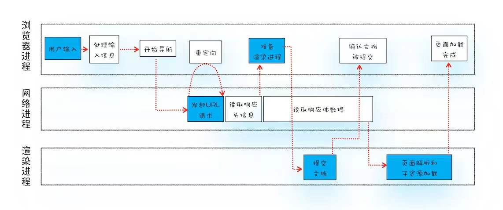
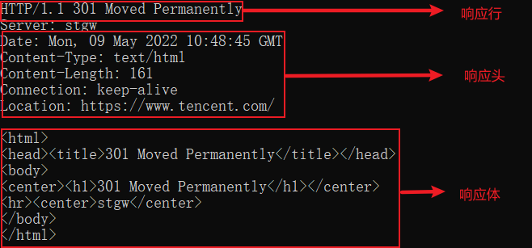
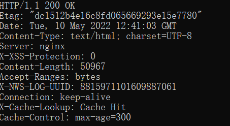

# 导航流程



从图中可以看出，**整个过程需要各个进程之间的配合**，所以在开始正式流程之前，我们还是先来快速回顾下浏览器进程、渲染进程和网络进程的主要职责。

- 浏览器进程主要负责用户交互、子进程管理和文件储存等功能。
- 网络进程是面向渲染进程和浏览器进程等提供网络下载功能。
- 渲染进程的主要职责是吧从网络下载的HTML、JavaScript、CSS、图片等资源解析为可以显示和交互的页面。因为渲染进程所有的内容都是通过网络获取的，会存在一些恶意代码利用浏览器漏洞对系统进行攻击，所以在渲染进程里面的代码是不被信任的。所以渲染进程运行在安全沙箱里面，保证系统的安全。

如上图所示的完整流程，可以看出整个流程包含许多步骤，我们把其中几个核心的节点用蓝色背景标记出来了。这个过程可以大致描述如下：

1. 首先，浏览器进程接收到用户输入的URL请求，浏览器进程便将该URL转发给网络进程。

2. 然后，在网络进程中发起真正的URL请求。

3. 接着网络进程接收到了响应头数据，便解析响应头数据，并将数据转发给浏览器的进程。

4. 浏览器进程接收到网络进程的响应头数据之后，发送**提交导航（CommitNavigation）**消息到渲染进程。

5. 渲染进程接收到**提交导航**的消息之后，便开始准备接受HTML数据，接收数据的方式时直接和网络进程建立数据管道。

6. 最后渲染进程会向浏览器进程**确认提交**，告诉浏览器，已经准备好接收和解析页面数据了。

7. 浏览器进程接收到渲染进程**提交文档**的消息之后，便开始一处之前的就文档，然后更新浏览器进程中的页面状态。

   

在其中，**用户发出的URL请求到页面开始解析的这个过程，叫做导航**

#### 从输入URL到页面展示

现在我们知道了浏览器几个主要进程的职责，还有在导航过程中需要经历的几个主要的阶段，下面我们就来详细分析这些阶段。

#### 1.用户输入

当用户在地址栏中输入一个查询关键字时，地址栏会判断输入的关键字时**搜索内容**，还是**请求的URL**

- 如果是搜索内容，地址栏会使用浏览器默认的搜索引擎，来合成新的带搜索关键字的URL。
- 如果判断输入的内容复合URL规则，比如输入的是tencent.com那么地址栏会根据规则，把这段内容加上协议，合成为完整的URL，如https://www.tencent.com。

当用户输入关键字并回车之后，这意味着当前页面即将要被替换成新的页面，不过在这个流程继续之前，浏览器还给你当前页面一次执行beforeunload时间的机会，beforeunload时间允许页面在退出之前执行一些数据清理操作，还可以询问用户是否要离开当前页面，比如当前页面可能有未提交完成的表单等情况，因此用户可以通过beforeunload事件来取消导航，让浏览器不再执行任何后续工作。

当前页面没有监听beforeunload事件或者同意了继续后续流程，那么浏览器就进入了下图的状态：


从图中可以看出，当浏览器开始加载一个地址之后，标签页上的图标便进入了加载状态。但此时途中页面显示的依旧是之前打开的页面内容。并没有立即替换为tx官网的页面。因为需要等待提交文档阶段，页面内容才会被替换。

#### 2.URL请求流程

接下来，便进入了页面资源请求过程。这时，浏览器进程会通过进程间通信（IPC）把URL请求发送至网络进程，网络进程接收到URL请求后，会在这里发起真正的URL请求流程。

首先，网络进程会查找本地缓存是否缓存了该资源。如果有资源，那么返回资源给浏览器进程；如果有缓存资源，那么直接返回资源给浏览器进程；如果在缓存中没有查找到该资源，就进入网络请求流程。在请求前还要进行DNS解析，以获取请求域名的服务器IP地址。如果请求西医是HTTPS，那么还要建立TLS连接。

接下来就是利用IP地址和服务器建立TCP连接，连接建立之后，浏览器端会构建请求行，请求头等信息，并把该域名相关的Cookie等数据附加到请求头中，然后向服务器发送构建的请求信息。

服务器接收到请求信息后，会根据请求信息生成响应数据（包括响应行、响应头和响应体等信息），并发给网络进程。等网络进程接收了响应行和响应头之后，就开始解析响应头的内容了。

#####  （1）重定向

在接收到服务器返回的响应头后，网络进程开始解析响应头，如果发现返回的状态码是301或者302，那么说明服务器需要浏览器重定向到其他URL。这是网络进程会从Location字段里面读取重定向的地址，然后再发起新的HTTP或者HTTPS请求，一切又从头开始。

```
curl -i http//:tencent.com
```



这时候我们直接请求https://www.tencent.com，可以看到返回的状态码变成了200，这是告诉浏览器一切正常，可以继续往下处理请求了。

```
curl -i https://www.tencent.com
```



##### （2）响应数据类型处理

在处理了跳转信息之后，我们继续导航流程的分析。URL请求的数据类型，有时候是一个下载类型，有时候是正常的HTML页面，那么浏览器怎么区分它们呢？通过Content-Type。

**Content-Type是HTTP头中一个非常重要的字段，它告诉浏览器服务器返回的响应体数据是什么类型，**然后浏览器会根据Content-Type的值来决定如何显示响应体的内容。

从上图可以看出Content-Type字段的值是`text/html;charset=UTF-8`这就是告诉浏览器，服务器返回的数据是HTML格式，字符集是UTF-8.

如果响应头的Content-Type的值是application/octet-steam，显示数据是**字节流类型**的，通常情况下，浏览器会按照**下载类型**来处理该请求。

需要注意的是。如果服务器配置Content-Type不正确，比如将text/html配置成application/octet-steam，那么浏览器会去接文件内容，把本来用来展示的页面，变成了一个下载文件。

所以，不同的`Content-Type`的后续处理流程也不同。如果`Content-Type`字段的值被浏览器判断为**下载类型，那么该请求会被提交给浏览器的下载管理器，同时该URL请求的导航流程到此结束**。但是如果是**HTML，那么浏览器则会继续进行导航流程**，由于Chrome的页面渲染是在运行在渲染进程中的，所以接下来就需要准备渲染进程了。

#### 3.准备渲染进程

默认情况下，Chome会为每个页面非陪一个渲染进程，也就是说，没打开一个新的页面就会配套创建一个新的渲染进程。但是也有例外，在某些情况下，浏览器会让多个页面直接运行在同一个渲染进程中。

如果几个页面是同一站点(same-site)。就是**协议（http:// 或者https://）** +**根域名(www.huawei.com)** ，还包含了该根域名下所有的子域名和不同端口。他们都是属于**同一站点**。

Chrome的默认策略是，**每一个标签对应一个渲染进程。但如果从一个页面打开了另一个新页面，而新页面和当前页面属于同一站点的话，那么新页面会复用父页面的渲染进程。**官方把这个默认策略叫process-per-site-instance。


如果新页面跟当前页面不属于同一站点，浏览器就会使用一个新的进程。

#### 4.提交文档

所谓提交文档，就是浏览器进程将网络进程接收到的HTML数据提交给渲染进程，具体流程是这样的：

- 首先当浏览器进程接收到网络进程的响应头数据之后，便向渲染进程发起**提交文档**的消息
- 渲染进程接收到**提交文档**的消息后，回合网络进程建立传输数据的管道
- 等文档数据传输完成之后，渲染进程会返回**确认提交**的消息给浏览器进程
- 浏览器进程在收到**确认提交**的消息后会跟新浏览器界面状态，包括安全状态，地址栏的URL，前进后退的历史状态，并更新Web页面。


这也就解释了为什么在浏览器的地址栏输入了一个地址后，之前的页面没有立马消失，而是要加载一会儿才会更新页面。

到这里，一个完整的导航流程就走完了。

#### 5.渲染阶段

一旦文档被提交，渲染进程便开始页面解析和子资源加载了，关于这个阶段的完整过程，下一篇将专门介绍。一旦页面生成完成，渲染进程会发送一个消息给浏览器进程，浏览器接收到消息后，会停止标签图标上的加载动画。如上图所示。