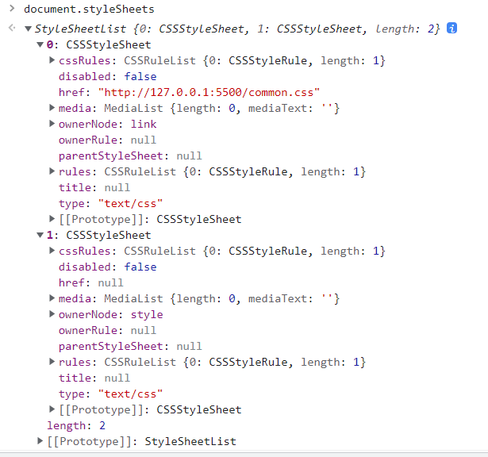

# 渲染流程


**HTML的内容是由标记和文本组成**。标记也称为**标签**，每个标签都有自己的语义，浏览器根据标签的语义来展示HTML内容

如果 改变HTML的字体颜色、大小等信息，就需要用到**CSS**。CSS又称为**层叠样式表**，是由选择器和属性组成，它会把选择器的属性值应用到<p>标签内容上，选择器里面有个color属性，他的值是red。这是告诉渲染引擎把<p>标签的内容显示为红色。

**JS**，使用它可以让网页内容“动”起来。

由于渲染机制过于复杂，所以渲染模块在执行过程中被划分为很多子阶段，输入的HTML经过这些子阶段，最后输出像素。我们把这样的一个处理流程叫做**渲染流水线**

按照渲染的事件顺序，流水线可以分为如下几个子阶段:

- 构建DOM树
- 样式计算
- 布局阶段
- 分层
- 绘制
- 分块
- 光栅化
- 合成

每个阶段都有它**输入的内容**、**处理过程**、**输出内容**

#### 构建DOM树

浏览器无法直接理解和使用HTML，所以需要将HTML转换为浏览器能够理解的结构——**DOM树**


可以通过js来修改内容

```js
document.getElementsByTagName('p')[0].innerText = '我是内容2';
```


#### 样式计算

样式计算的目的是为了计算出DOM节点中每个元素的具体样式，这个阶段大体可以分为三步来完成。

##### 1.把css转换为浏览器能够理解的结构


CSS样式来源主要有三种：

- 通过link引用外部CSS文件

- `<style>`标签标记内的CSS

- 元素的style属性内嵌的CSS

  

和HTML一样，浏览器也是无法直接理解这些纯文本的CSS样式，所以**当渲染引擎接收到CSS文本时，会执行一个转换操作，将CSS文本转换为浏览器可以理解的结构——styleSheets**



从图中可以看出，这个样式表包含了很多种样式，已经把前面三种来源的样式都包含进去了

##### 2.转换样式表中的属性值，使其标准化

现在已经把现有的CSS文本转化为浏览器可以理解的机构了，**接下来就是对其进行属性值标准化操作*

```css
body {font-size:2em}
p {color:blue}
span {display: none}
div {font-weight: bold}
div p {color: green}
div {color: red}
```

上面的CSS文本有很多属性值，2em、blue、bold，这些类型数值不容易被渲染引擎理解，所以**需要将所有值转换为渲染引擎容易理解的、标准化的计算值**，这个过程就是属性值的标准化。


##### 3.计算出DOM树中每个节点的具体样式

现在样式的属性已经被标准化了，接下来就需要计算DOM树中每个节点的样式属性了。

涉及到**CSS的继承规则和层叠规则**

首先是CSS继承。**CSS继承就是每个DOM节点都包含有父节点的样式**


从图中可以看出，所有子节点都继承了父节点的样式。body节点的font-size属性是20px，body节点下的所有节点的font-size都等于20px


- 首先，选中需要查看的元素的样式
- 其次，可以从**样式来源**中查看样式的具体来源信息，看看是来源于样式文件，还是来源于UserAgent样式表。**UserAgent样式表，它是浏览器提供的一组默认样式，如果你不提供任何样式，默认使用的就是UserAgent样式**
- 最后可以通过 `from xxx `来判断样式继承的**具体文件**和**具体过程**

样式计算过程中第二个规则是样式层叠。**层叠是CSS的一个基本特征，他是定义了如何合并来自多个源的属性值的算法。它在CSS处于核心地位，CSS的全称“层叠样式表”正强调了这一点**

总之，样式计算阶段的目的是为了计算出DOM节点中每个元素的具体样式，在计算过程中需要遵守CSS的继承和层叠两个规则。这个阶段的最终输出的内容是每个DOM节点的样式，并被保存在ComputedStyle的结构内。


#### 布局阶段

现在，我们有DOM树和DOM树中元素的样式，但这还不足以显示页面，因为我们不知道DOM元素的几何位置信息。那么**接下来就需要计算出DOM树中可见元素的几何位置，我们把这个计算过程叫做布局。**

###### 1.创建布局树

DOM树还含有很多不可见的元素，比如<head>，还有使用了display:none属性的元素。所以**在显示之前，我们还要额外构建一棵只包含可见元素布局树。**


从上图可以看出，DOM树所有不可兼得节点都没有包含到布局树中

为了构建布局树，浏览器答题上完成了下面这些工作：

- 遍历DOM树中的所有可见节点，并把这些节点加到布局树中

- 不可见的节点会被布局树忽略掉，如<head>标签下的所有内容，再比如body.p.span这个元素，它的属性包含display:none，所以这个元素也没有被包进布局树。

  

###### 2.布局计算

现在我们有了一颗完整的布局树。那么接下来就要计算布局树节点的坐标位置了。布局的计算过程非常复杂，这里先略过。

在执行布局操作的时候，会把布局运算的结果重新写回布局树中，所以布局树既是输入内容又是输出内容，这是布局阶段一个不合理的地方，应为在布局阶段没有清晰地将输入内容和输出内容区分开。针对这个问题Chrome团队正在重构布局的代码，下一代布局系统叫**layoutNG**（有兴趣的同学可以去了解下），试图更清晰地分离输入和输出，从而让新设计的布局算法更简单。

#### 分层

现在有了布局树，我们依旧还不进行绘制页面。

页面中有很多复杂的效果，比如一些复杂的3D变换、页面滚动、或者使用z-index做z轴排序等，为了更方便地实现这些效果、**渲染引擎还需要为特定的节点生成专用的图层，并生成一棵对应的图层树(LayerTree)**,比如PS有图层的概念，正式这些图层叠加在一起构成了最终的页面图像。


从上图可以看出，渲染引擎给页面分了很多图层，这些图层按照一定顺序叠加在一起，就形成了最终的界面。

通常情况下，**并不是布局树的每一个节点都包含一个图层，如果一个节点没有对应的图层，那么这个节点就从属于父节点的图层**

那么要满足什么条件，渲染引擎才会为特定的节点创建新的图层呢？通常满足下面两点钟任意一点的元素就可以被提升为一个单独的一个图层。

- **第一点，拥有层叠上下文属性的父元素会被提升为单独的一层**

  页面是个二维平面，但是层叠上下文能够让HTML元素具有三维盖帘，这些HTML元素按照自身属性的优先级分布在垂直于这个二位平面的z轴上。

从图中可以看出，明确定位属性的元素、定义透明属性的元素、使用CSS滤镜的元素等、都有层叠上下文的属性

有兴趣的同学可以去看看[MDN上关于层叠上下文的定义](https://developer.mozilla.org/zh-CN/docs/Web/CSS/CSS_Positioning/Understanding_z_index/The_stacking_context)

- **第二点，需要剪裁(clip)的地方也会被创建为图层**

  什么是裁剪呢？

```html
 <style>
     div{
        width: 200px;
        height:200px;
        overflow: auto;
        color:aliceblue;
        background: #333333;
     }
 </style>
<body>
    <div><span style="font-weight: 700;">永和九年，岁在癸丑，暮春之初，会于会稽山阴之兰亭，修禊事也。群贤毕至，少长咸集。此地有崇山峻岭，茂林修竹，又有清流激湍，映带左右，引以为流觞曲水，列坐其次。虽无丝竹管弦之盛，一觞一咏，亦足以畅叙幽情。
        是日也，天朗气清，惠风和畅。仰观宇宙之大，俯察品类之盛，所以游目骋怀，足以极视听之娱，信可乐也。
        夫人之相与，俯仰一世。或取诸怀抱，悟言一室之内；或因寄所托，放浪形骸之外。虽趣舍万殊，静躁不同，当其欣于所遇，暂得于己，快然自足，不知老之将至；及其所之既倦，情随事迁，感慨系之矣。向之所欣，俯仰之间，已为陈迹，犹不能不以之兴怀，况修短随化，终期于尽！古人云：“死生亦大矣。”岂不痛哉！
        每览昔人兴感之由，若合一契，未尝不临文嗟悼，不能喻之于怀。固知一死生为虚诞，齐彭殇为妄作。后之视今，亦犹今之视昔，悲夫！故列叙时人，录其所述，虽世殊事异，所以兴怀，其致一也。后之览者，亦将有感于斯文。</span></div>
</body>
```


出现这种剪裁情况的时候，渲染引擎回会文字部分单独创建一个层，如果出现未滚动条，则不会被提升为单独的层。


#### 图层绘制

在完成图层树的构建之后，渲染引擎会对图层树的每一个图层进行绘制，

渲染引擎引擎实现图层的绘制时， 会把一个图层的绘制拆分为很多小的**绘制指令**，然后再把这些指令按照顺序组成一个待绘制的列表

我们可以在控制台的Layers标签中选择document的Profiler，就能通过这两个滑块来查看待绘制列表的具体执行过程。


#### 光栅化(raster)

绘制列表只是用来记录绘制顺序和绘制指令的列表，而实际上绘制操作是由渲染引擎中的合成线程来完成的


如图所示，当图层的绘制列表准备好之后，主线程会把绘制列表**提交（commit）**给合成线程。

我们都知道浏览器窗口是有个**视口（viewport）**的，在有些情况，有的图层可以很大，比如有些页面你需要滚动好久才能滚动到底部，但是通过视口，用户只能看到一小部分页面，所以在这种情况下，要绘制出所有图层内容的话就会产生太大的开销。

基于此，**合成线程会将图层划分为图块(tile)**,这些图块的大小通常是 256px * 256px 或者 512px * 512px.

然后**合成线程会按照视口附近的图块来有限生成位图，实际生成位图的操作是由栅格化来执行的。所谓栅格化，是指将图块转化为位图**。

而图块是栅格化执行的最小单位。渲染进程维护了一个栅格化的线程池，所有的图块栅格化都是在线程池内执行的。


通常，栅格化过程使用GPU来加速生成，使用GPU生成位图的过程叫**快速栅格化**，或者**GPU栅格化**，生成的位图保存在GPU内存中。

GPU操作是在GPU进程中，如果栅格化操作使用了GPU，那么最终生成位图的操作是在GPU中完成的，这就涉及到了跨进程操作。


从上图可以看出，渲染进程把生成图块的指令发送给GPU，然后在GPU中执行生成图块的位图，并保存在GPU的内存中。

#### 合成与显示

一旦所有图块都被光栅化，合成线程就会执行一个绘制图块的命令**DrawQuad**,然后将该命令提交给浏览器进程。

浏览器进程里面有一个叫做**viz**的组件，用来接收合成线程发过来的**DrawQuad**命令，然后根据**DrawQuad**命令，将其页面绘制到内存中，最后再将内存显示在屏幕上。

到这里，浏览器就能显示出我们想要的页面了

#### 重排(reflow)、重绘(repanit)、合成

##### 1.更新了元素的几何属性(重排)


如果通过JS或者CSS修改了元素的几何位置属性，比如改变高度，宽度、位置等，那么浏览器会触发重新布局，解析之后的一系列子阶段，这个过程就叫**重排**。

**重排需要更新完整的渲染流水线，所以开销也是很大的**

##### 2.更新元素的绘制属性(重绘)

如果修改了元素的背景颜色等。


从图中可以看出，如果修改了元素的背景颜色，那么布局阶段不会执行，因为没有引起几何位置的变换，所以直接进入到了**绘制阶段**

之后执行后续的一系列子阶段，这个过程就叫做**重绘**。相较于重排操作，重绘省去了布局跟分层阶段，所以执行效率回避重排操作要高一些

##### 3.直接合成阶段

如果更新了一个既不需要**布局**也不需要**绘制**的属性，会发生什么变化呢？渲染流程会直接跳过布局跟绘制，只执行后续的合成操作。


比如使用transform来实现动画效果，这样可以避开重排和重绘阶段，直接在非主线程上执行合成动画操作，这样的效率是最高的，因为没有占用主线程的资源，同时避开了**重排**与**重绘**，所以**相比较于重排与重绘，直接合成能大大提高绘制效率**