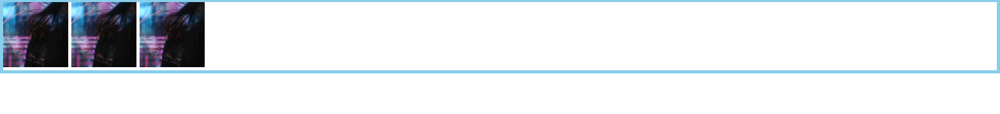
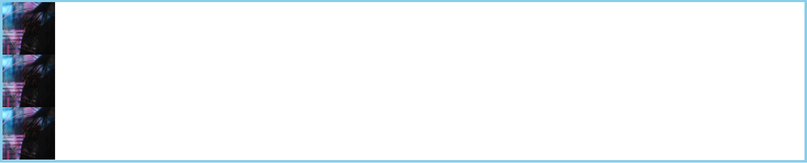

# img标签图片白边的处理方式

```html
<div class="father">
      
      
      
 </div>
```

```css
*{
   margin: 0;
   padding: 0;
}
.father{
   border: 5px solid skyblue;
}
img{
    width:100px;
    height:100px
}
```



可以看到图片与图片之间、图片与盒子的bottom之间有明显的白色空隙。

### 处理方式：

#### 1.设置父盒子的`font-size:0;`

```css
*{
   margin: 0;
   padding: 0;
}
.father{
   border: 5px solid skyblue;
   font-size:0;
}
img{
    width:100px;
    height:100px
}
```

完美解决。


#### 2.用div将img标签包裹 & 父盒子设置`display:flex`。

```html
<div class="father">
    <div class="son">
       
    </div>
    <div class="son">
       
    </div>
    <div class="son">
       
    </div>
</div>
```

并且这里的`img`标签需要`width:100%; height:100%;`给`.son`设置具体的`width `、`height`

```css
*{
   margin: 0;
   padding: 0;
}
.father{
   border: 5px solid skyblue;
}
.son{
   width: 100px;
   height: 100px;
}
img{
    width:100%;
    height:100%;
}
```


这样会使得每个`.son`盒子单独占一行。

我们再给`.father`盒子加一个 `dispaly:flex`

```css
*{
   margin: 0;
   padding: 0;
}
.father{
   border: 5px solid skyblue;
   display:flex
}
.son{
   width: 100px;
   height: 100px;
}
img{
    width:100%;
    height:100%;
}
```

可以看到，实现了一样的效果。


**给img标签设置成display:block跟用盒子包裹是一样的效果。**



同样给`.father`设置`display:flex`是一样的效果。


而设置`img`标签为`display:inline-block`达不到目的。

#### 3.垂直方向，可以设置`vertical-align:middle`

可以看到`img`标签跟父盒子bottom的空隙已经消除。

或者`top` `bottom` `text-bottom` `text-top` `sub` `-webkit-baseline-middle`都能实现这种效果